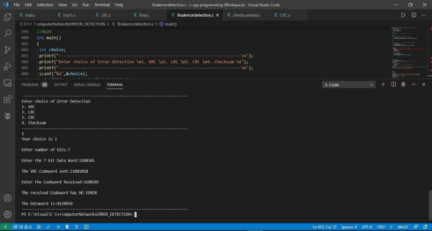

# Implementation-of-Error-Detection-Codes-in-Python

## AIM ##

To implement the various line encoding schemes and to create a command line program and a GUI based web application for the same. 

## THEORY ##

### VERTICAL REDUNANCY CHECK ###

- Vertical Redundancy Check is also known as Parity Check.  
- In this method,   redundant bit also called parity bit is added to each data unit. 
- This method includes even parity and odd parity.  
- Even parity means the total number of 1s in data is to be even and odd parity means the total number of 1s in data is to be odd. 

**Example** 

If the source wants to transmit data unit 1100111 using even parity to the destination. The source  will  have  to  pass  through  Even  Parity  Generator. 

Example 4.1: Vertical Redunancy Check Example 

Parity generator will count number of 1s in data unit and will add parity bit 

**Advantages:** 

- VRC can detect all single bit error. 
- It can also detect burst errors but only in those cases where number of bits changed is odd, i.e. 1, 3, 5, 7, …….etc. 

**Disadvantages:** 

- The major disadvantage of using this method for error detection is that it is not able to detect burst error if the number of bits changed is even, i.e. 2, 4, 6, 8, …….etc.** 

### LONGITUDINAL REDUNANCY CHECK ### 

- [Longitudinal Redundancy Check (LRC) ](https://practice.geeksforgeeks.org/problems/what-is-lrc)is also known as 2-D parity check. 
- In this method, data which the user want to send is organised into tables of rows and columns.  
- A block of bit is divided into table or matrix of rows and columns.  
- In order to detect an error, a redundant bit is added to the whole block and this block is transmitted to receiver.  
- The receiver uses this redundant row to detect error.  
- After checking the data for errors, receiver accepts the data and discards the redundant row of bits. 

**Example** 

If a block of 32 bits is to be transmitted, it is divided into matrix of four rows and eight columns which as shown in the following figure :** 

Fig 4.2: Example of LRC 

In this matrix of bits, a parity bit (odd or even) is calculated for each column. It means 32 bits 

data  plus  8  redundant  bits  are  transmitted  to  receiver.  Whenever  data  reaches  at  the destination, receiver uses LRC to detect error in data. 

### CYCLIC REDUNANCY CHECK ###

- CRC is based on the theory of Cyclic Error Correcting Codes** 
- Here systematic cyclic codes are used which encode the messages by adding a fixed length of a check value** 
- Cyclic Codes are simple to implement and are best suited for burst errors** 
- An n-bit CRC can detect any single error burst not longer than n bits** 
- CRC code specification depends on a ***generator polynomial***.** 
- The polynomial becomes the divisor and the data appended with zeros equal to 1 less than the no. of digits in the divisor is the dividend** 
- ***The modulo 2 division*** is performed and the remainder is appended to the data and transmitted** 
- On the receiver side the same division is performed with the received data and if there is a remainder then there is an error and if the remainder is 0 then there is no error** 
- Here the polynomial co-efficient are calculated according to the arithmetic of a finite field called ***Galois Field of two elements (GF (2))***. The elements are 0 and 1** 
- In GF(2) addition and subtraction are the same and they are logical XOR** 
- Multiplication is logical AND** 
- x+x=0 and x^2=x in GF(2)** 
- A CRC is called n-bit CRC if the check value is n-bit long** 

Fig 4.4: Sender side (transmitter) 

Therefore, the remainder is 001 and hence the encoded Data sent is 100100001. 

**Receiver Side:** 

Code word received at the receiver side:  100100001 

Fig 4.5: Receiver side 

Therefore, the remainder is all zeros. Hence, the Data received has **NO ERROR.** 

### CHECKSUM ###

For error detection by checksums, data is divided into fixed sized frames or segments. 

- **Sender’s End** − The sender adds the segments using 1’s complement arithmetic to get the sum. It then complements the sum to get the checksum and sends it along with the data frames. 
- **Receiver’s End** − The receiver adds the incoming segments along with the checksum using 1’s complement arithmetic to get the sum and then complements it. 

If the result is zero, the received frames are accepted; otherwise they are discarded. 

Fig 4.6: Checksum Example 

**OUTPUT:**

*Received data is same as Transmitted data* 

*Received data is different from the Transmitted data* 

**OUTPUT:** 

***VRC with NO ERROR*** 

***VRC with ERROR*** 

***LRC with NO ERROR*** 

***LRC with ERROR*** 

***CRC with NO ERROR*** 

***CRC with ERROR*** 

***Checksum with NO ERROR*** 

***Checksum with ERROR*** 

